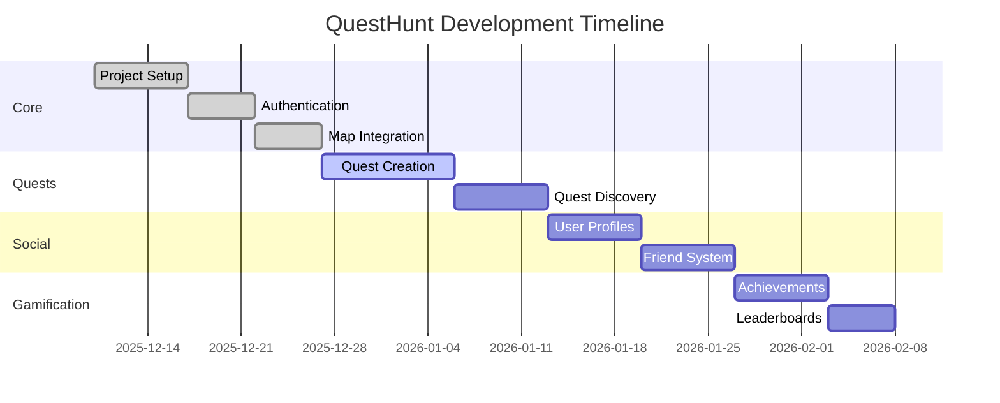

# QuestHunt Action Plan

_Last Updated: December 26, 2025_

## 🟢 Completed

### Core Infrastructure

- [x] Set up Next.js 16 project with TypeScript
- [x] Configured Tailwind CSS (v4) with shadcn/ui components
- [x] Set up ESLint and Prettier with custom rules
- [x] Configured TypeScript with strict type checking
- [x] Set up Supabase integration (DB/Auth/Storage)
- [x] Added Supabase SSR server client (`apps/web/lib/supabase/server.ts`)

### Backend API

- [x] Quest endpoints implemented (`/api/quests`, `/api/quests/[id]`)
- [x] Waypoints endpoints implemented (`/api/quests/[id]/waypoints`, `/api/quests/[id]/waypoints/[wpId]`)
- [x] Progress endpoints implemented (`/api/quests/[id]/start`, `/api/quests/[id]/complete`,
  `/api/waypoints/[wpId]/visit`)
- [x] Badges endpoints implemented (`/api/badges`, `/api/badges/stats`, `/api/badges/evaluate`)
- [x] Shared Zod schemas and service modules under `apps/web/lib/server/*` for forward-compatibility
- [x] Supabase migrations for progress, visits, badges, profiles, friends, and activities with RLS
- [x] DB-backed activity feed implementation (`/api/activities`)
- [x] Feature flagging system with Admin control

### Map Integration

- [x] Integrated MapLibre GL JS for interactive maps
- [x] Created reusable MapContainer component
- [x] Added marker management system
- [x] Implemented current location detection
- [x] Added geolocation controls

### UI Components

- [x] Set up theme provider
- [x] Created responsive navigation
- [x] Implemented toast notifications
- [x] Added form validation with Zod

### Quest Management

- [x] Set up quest API endpoints (Next.js Route Handlers under `apps/web/app/api/quests`)
- [x] Implement quest creation flow
  - [x] Add form fields for quest details (title, description, difficulty, duration)
  - [x] Implement rich text editor for quest descriptions (TipTap) — sanitize on render
  - [x] Implement waypoint management with map integration
  - [x] Add waypoint edit/delete and reorder within the form UI
  - [x] Add form validation (Zod + RHF) and server-side validation
- [x] Create quest listing page (refined UI and filters)
  - [x] Design and implement quest cards
  - [x] Add server-side filtering by difficulty (URL params → DB query)
  - [x] Implement sorting options (newest/oldest) server-side
  - [x] Add server-side search (ILIKE on title/description)
  - [x] Implement pagination (page/limit with URL sync and controls)

#### Quest Detail Page

- [x] Implement `/quests/[id]` page
  - [x] Fetch quest + waypoints (via API)
  - [x] Render map with markers
  - [x] Start quest action using `POST /api/quests/:id/start`
  - [x] Render rich description (stored HTML; sanitizer component available)

### User Profiles

- [x] API endpoints
  - [x] `GET /api/users/me` — current profile
  - [x] `PUT /api/users/me` — update current profile
  - [x] `GET /api/users/[id]` — public profile
  - [x] `GET /api/users/me/stats` — user quest statistics
  - [x] `GET /api/users/me/badges` — user unlocked badges
- [x] Profile pages
  - [x] `/profile` — enriched profile with stats, badges, and activity feed
  - [x] `/users/[id]` — public profile view

### Social Features

- [x] Friend system
  - [x] API: list, send, respond, remove
  - [x] UI: `/friends` page for management
  - [x] DB: Supabase migrations + RLS (friends table)
- [x] Activity feed
  - [x] DB-backed activities table and queries
  - [x] Feed UI on profile

### Gamification

- [x] Leaderboards
  - [x] API: top users by quests completed
  - [x] UI: `/leaderboard` page

## 🟡 In Progress

### Quest Management

- [ ] Add image upload for quest cover (S3/Supabase Storage)

### Social Features

- [ ] Messaging system
  - [ ] Schema (threads/messages)
  - [ ] Endpoints
  - [ ] Basic UI

### Gamification

- [ ] Achievements
  - [x] Badges UI component
  - [ ] Additional badge definitions and evaluation hooks

## 🔴 Planned

### Advanced Map Features

- [ ] Add route planning
- [ ] Implement offline maps
- [ ] Add custom map styles

### Testing

- [x] Add unit tests (Vitest) — Zod schemas
- [x] Add unit tests (Vitest) — API routes: profiles, friends, leaderboard
- [ ] Set up E2E testing (Playwright)

### Documentation

- [x] Write API documentation (README updated)
- [ ] Create user guides
- [ ] Add developer documentation

## 📅 Upcoming Milestones

### Milestone 1: MVP (Target: Jan 15, 2026)

- [ ] Complete quest creation flow
- [ ] Implement basic user profiles
- [ ] Deploy to staging environment

### Milestone 2: Social Features (Target: Feb 15, 2026)

- [x] Friend system — API MVP complete
- [ ] Friend system — DB migrations + UI
- [ ] Activity feed — DB-backed implementation + UI
- [ ] Messaging system — MVP

### Milestone 3: Gamification (Target: Mar 15, 2026)

- [x] Leaderboards — API MVP complete
- [ ] Leaderboards — UI component
- [ ] Achievements — badges UI + additional rules
- [ ] Challenges and events — schema + MVP

## 📊 Progress

## 📝 Notes

- All dates are estimates and subject to change
- Priorities may shift based on user feedback
- New features may be added to the roadmap as needed

## 🤝 Contributing

1. Fork the repository
2. Create a feature branch (`git checkout -b feature/AmazingFeature`)
3. Commit your changes (`git commit -m 'Add some AmazingFeature'`)
4. Push to the branch (`git push origin feature/AmazingFeature`)
5. Open a Pull Request

## 📄 License

This project is licensed under the MIT License - see the [LICENSE](LICENSE) file for details.
