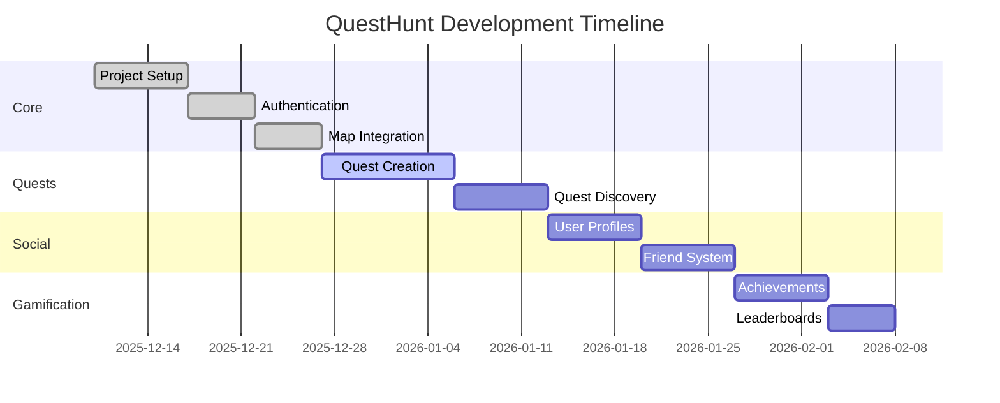

# QuestHunt Action Plan

*Last Updated: December 21, 2025*

## 🟢 Completed

### Core Infrastructure

- [x] Set up Next.js 16 project with TypeScript
- [x] Configured Tailwind CSS (v4) with shadcn/ui components
- [x] Set up ESLint and Prettier with custom rules
- [x] Configured TypeScript with strict type checking
- [x] Set up Supabase integration (DB/Auth/Storage)
- [x] Added Supabase SSR server client (`apps/web/lib/supabase/server.ts`)

### Backend API

- [x] Quest endpoints implemented (`/api/quests`, `/api/quests/[id]`)
- [x] Waypoints endpoints implemented (`/api/quests/[id]/waypoints`, `/api/quests/[id]/waypoints/[wpId]`)
- [x] Progress endpoints implemented (`/api/quests/[id]/start`, `/api/quests/[id]/complete`,
  `/api/waypoints/[wpId]/visit`)
- [x] Badges endpoints implemented (`/api/badges`, `/api/badges/stats`, `/api/badges/evaluate`)
- [x] Shared Zod schemas and service modules under `apps/web/lib/server/*` for forward-compatibility
- [x] Supabase migrations for progress, visits, and badges with RLS

### Map Integration

- [x] Integrated MapLibre GL JS for interactive maps
- [x] Created reusable MapContainer component
- [x] Added marker management system
- [x] Implemented current location detection
- [x] Added geolocation controls

### UI Components

- [x] Set up theme provider
- [x] Created responsive navigation
- [x] Implemented toast notifications
- [x] Added form validation with Zod

## 🟡 In Progress

### Quest Management

- [x] Set up quest API endpoints (Next.js Route Handlers under `apps/web/app/api/quests`)
- [x] Implement quest creation form
  - [x] Add form fields for quest details (title, description, difficulty, duration)
  - [x] Implement rich text editor for quest descriptions (TipTap) — sanitize on render
  - [ ] Add image upload for quest cover (deferred)
  - [x] Implement waypoint management with map integration (basic persistence on creation)
  - [x] Add waypoint edit/delete and reorder within the form UI
  - [x] Add form validation (Zod + RHF) and server-side validation
- [x] Create quest listing page (refined UI and filters)
  - [x] Design and implement quest cards
  - [x] Add server-side filtering by difficulty (URL params → DB query)
  - [x] Implement sorting options (newest/oldest) server-side
  - [x] Add server-side search (ILIKE on title/description)
  - [x] Implement pagination (page/limit with URL sync and controls)

#### Quest Detail Page

- [x] Implement `/quests/[id]` page
  - [x] Fetch quest + waypoints (via API)
  - [x] Render map with markers
  - [x] Start quest action using `POST /api/quests/:id/start`
  - [x] Render rich description (stored HTML; sanitizer component available)

### User Profiles

- [x] API endpoints
  - [x] `GET /api/users/me` — current profile
  - [x] `PUT /api/users/me` — update current profile
  - [x] `GET /api/users/[id]` — public profile
- [x] Profile pages
  - [x] `/profile` — edit own profile (username, display_name, bio, location, avatar_url)
  - [x] `/users/[id]` — public profile view
- [x] Tests
  - [x] Unit tests for `GET/PUT /api/users/me` (Vitest)
- [ ] Enhancements (planned)
  - [ ] User stats (quests completed, created, etc.)
  - [ ] Activity feed (DB-backed)
  - [ ] Badges and achievements on profile
  - [ ] Avatar upload via Supabase Storage
  - [ ] Notification preferences

## 🔴 Planned

### Social Features

- [x] Friend system (API MVP)
  - [x] `GET /api/friends` — list friendships/requests
  - [x] `POST /api/friends` — send friend request
  - [x] `PUT /api/friends/[id]?action=accept|decline` — respond to request
  - [x] `DELETE /api/friends/[id]` — remove friendship
  - [ ] UI integration (list, accept/decline in app)
  - [ ] Supabase migrations + RLS (friends table)
- [ ] Activity feed
  - [x] Mocked endpoint `/api/activities` (dev only)
  - [ ] DB-backed activities table and queries
  - [ ] Feed UI on profile/home
- [ ] Messaging system
  - [ ] Schema (threads/messages)
  - [ ] Endpoints
  - [ ] Basic UI
- [ ] Social sharing
  - [ ] Share quest links (Open Graph cards)

### Advanced Map Features

- [ ] Add route planning
- [ ] Implement offline maps
- [ ] Add custom map styles
- [ ] Integrate with more map providers

### Gamification

- [x] Leaderboards (API MVP)
  - [x] `GET /api/leaderboard` — top users by quests completed
  - [ ] UI leaderboard component
- [ ] Achievements
  - [x] Badges endpoints exist (`/api/badges`, `/api/badges/stats`, `/api/badges/evaluate`)
  - [ ] Map badges to achievement UI + profile display
  - [ ] Additional badge definitions and evaluation hooks
- [ ] Challenges and events
  - [ ] Define schema and endpoints

### Performance & Optimization

- [ ] Implement image optimization
- [ ] Add code splitting
- [ ] Set up performance monitoring
- [ ] Implement caching strategies

### Testing

- [x] Add unit tests (Vitest) — Zod schemas
- [x] Add unit tests (Vitest) — API routes: profiles, friends, leaderboard
- [ ] Implement integration tests
- [ ] Set up E2E testing (Playwright smoke planned next)
- [ ] Add accessibility testing

### Documentation

- [x] Write API documentation (README updated with endpoints)
- [ ] Create user guides
- [ ] Add developer documentation
- [ ] Create deployment guides

## 📅 Upcoming Milestones

### Milestone 1: MVP (Target: Jan 15, 2026)

- [ ] Complete quest creation flow
- [ ] Implement basic user profiles
- [ ] Deploy to staging environment

### Milestone 2: Social Features (Target: Feb 15, 2026)

- [x] Friend system — API MVP complete
- [ ] Friend system — DB migrations + UI
- [ ] Activity feed — DB-backed implementation + UI
- [ ] Messaging system — MVP

### Milestone 3: Gamification (Target: Mar 15, 2026)

- [x] Leaderboards — API MVP complete
- [ ] Leaderboards — UI component
- [ ] Achievements — badges UI + additional rules
- [ ] Challenges and events — schema + MVP

## 📊 Progress

## 📝 Notes

- All dates are estimates and subject to change
- Priorities may shift based on user feedback
- New features may be added to the roadmap as needed

## 🤝 Contributing

1. Fork the repository
2. Create a feature branch (`git checkout -b feature/AmazingFeature`)
3. Commit your changes (`git commit -m 'Add some AmazingFeature'`)
4. Push to the branch (`git push origin feature/AmazingFeature`)
5. Open a Pull Request

## 📄 License

This project is licensed under the MIT License - see the [LICENSE](LICENSE) file for details.
